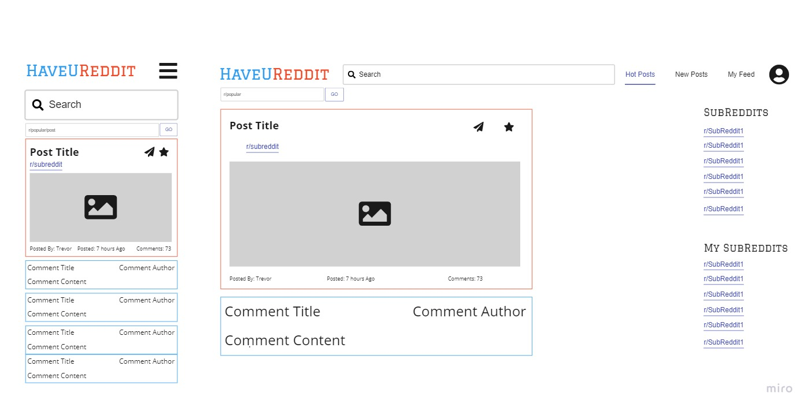

# HaveUReddit

A read only client for the Reddit website

## Features

- View the most popular posts on SubReddit
- Search for subreddits and posts
- Filter posts based on predefined categories

## Future Work

- Ability to save posts locally
- Remember your top 3 searches
- Keep a list of your favourite subreddits
- Forward interesting posts to your friends and social media

## Wireframes
In the image mobile layout is on the left, whilst desktop layout is on the
right.

### Landing Page / SubReddit Page

### Post View

### Search Results

### Layout Template for Pages

## The Tech Stack

- HTML
- CSS
- JavaScript
- React
- Redux
- Redux Toolkit
